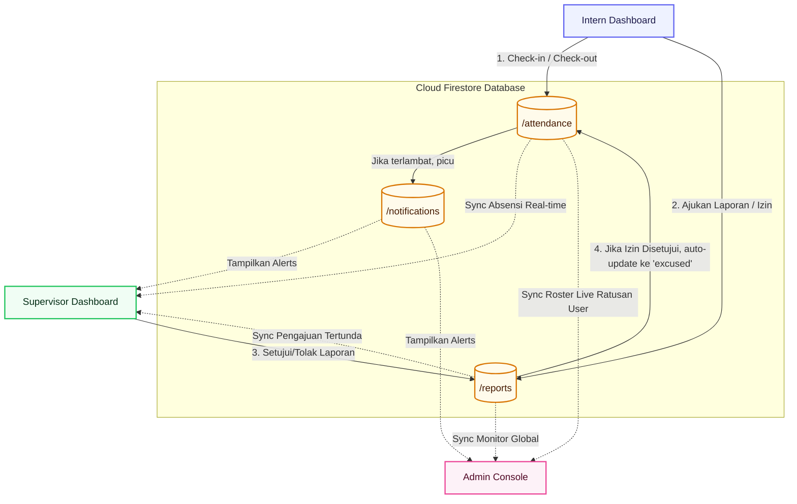
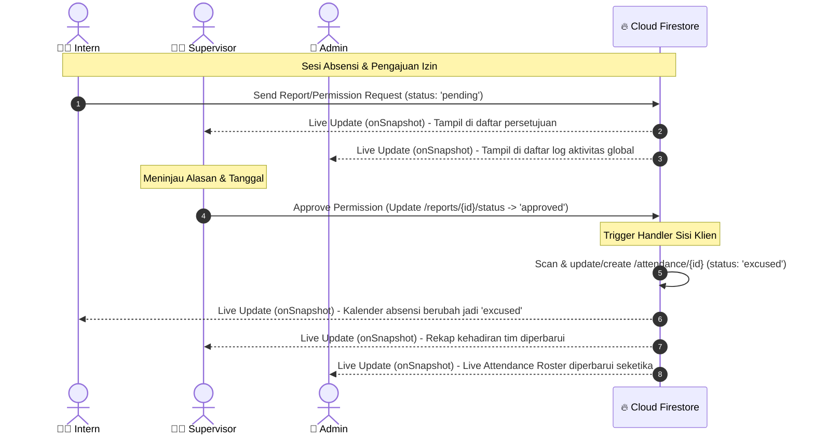
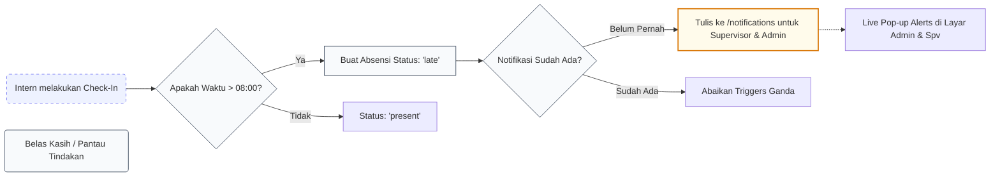

# Arsitektur & Alur Kerja Sistem Portal SOM

Dokumen ini menjelaskan arsitektur lengkap, teknologi pendukung, struktur data, dan alur kerja real-time dari aplikasi Portal **SOM (State of Mindfulness/Mentorship)**.

---

## 1. Ikhtisar Arsitektur (Architecture Overview)

Sistem dibangun menggunakan arsitektur **Full-Stack Jamstack Modern** dengan pembaruan real-time menggunakan **Google Firebase Suite** yang dipadukan dengan runtime **Node.js/Express** di sisi server (jika diperlukan proxy API).

Aplikasi berjalan di atas container **Cloud Run** dengan topologi sebagai berikut:

```
                  +-----------------------------------+
                  |        Client Browser (SPA)       |
                  |  (React 19, Tailwind CSS v4, etc.)|
                  +-----------------------------------+
                                    |
                    +---------------+---------------+
                    | (Real-time Sync / Direct SDK) |
                    v                               v
         +--------------------+           +------------------------+
         | Firebase Auth      |           | Firestore Database     |
         | (Autentikasi Sesi) |           | (Structured Documents) |
         +--------------------+           +------------------------+
```

---

## 2. Detil Komponen Teknologi (Tech Stack)

### Frontend (User Interface)
*   **React 19 & Vite**: Framework SPA ultra-cepat, di-render di sisi client dengan Node.js Express penanganan fallback routing.
*   **Tailwind CSS v4**: Penyuntingan gaya utilitas tingkat rendah yang sangat responsif, mendukung fluid layout pada ponsel, tablet, dan desktop.
*   **Motion (`motion/react`)**: Digunakan untuk animasi transisi antar halaman, feedback mikro (hover/klik), serta stagger animasinya.
*   **Lucide-React**: Set ikon vektor yang digunakan secara konsisten tanpa SVG manual.

### Backend & Database (BaaS)
*   **Firebase Authentication**: Menangani login, register, dan manajemen sesi pengguna secara aman.
*   **Cloud FireStore**: Database NoSQL dokumen terkelola dari Google Cloud Platform yang mendukung update real-time via WebSocket (`onSnapshot()`).
*   **Nginx Reverse Proxy**: Mengarahkan seluruh trafik luar dari port asal ke Port tunggal 3000 secara terintegrasi.

---

## 3. Alur Hubungan & Sinkronisasi Data (Real-time Flow)

Portal membagi pengguna menjadi tiga peran utama dengan alur distribusi data yang saling terhubung:

```
+------------------------------------------------------------------------+
|   ADMIN (Roster Monitoring, User Administration, Global Oversight)      |
+------------------------------------------------------------------------+
                               ^                                ^ (Live Sync)
                               |                                |
+-------------------------------------+      +---------------------------+
| SUPERVISOR (Approval & Team Monitor)| <--> |  INTERN (Daily Activities)|
+-------------------------------------+      +---------------------------+
```

### A. Alur Absensi Rutin Harian (Check-in Sequence)
1.  **Intern/Supervisor** menekan tombol **Check-in**.
2.  Sistem menangkap waktu sekarang dan membandingkannya dengan jadwal kerja (`schedule.startTime` default: **08:00**).
3.  Jika waktu saat ini melewati ketentuan, status akan tercatat otomatis sebagai `late` (Terlambat). Sebaliknya, tercatat sebagai `present` (Hadir).
4.  Data absensi baru ditulis langsung ke koleksi `/attendance`.
5.  **Notifikasi Sekali Saja (Late Alert)**:
    *   Jika status `late`, fungsi akan mengecek apakah supervisor atau admin hari ini sudah pernah menerima notifikasi keterlambatan intern terkait.
    *   Jika belum, triggers pembuatan notifikasi di `/notifications` satu kali untuk supervisor dan seluruh admin.
6.  Admin melihat data kehadiran seketika di **Attendance Bar (Live Roster)** berkat listener Firestore.

### B. Alur Pengajuan Kegiatan & Perizinan (Reports & Permission Status)
1.  **Intern** mengisi form perizinan atau kegiatan (Laporan Baru) pada Dashboard mereka.
    *   `Type: "activity"` (Laporan kegiatan harian).
    *   `Type: "permission"` (Permohonan izin/sakit).
2.  Laporan tersimpan di `/reports` dengan status `pending` dan merekam ID Supervisor terkait (`supervisorId`).
3.  **Supervisor** menerima update instan di bagian **Persetujuan Laporan & Izin** berkat filter query:
    `or(where('supervisorId', '==', user.id), where('userId', '==', user.id))`.
4.  Supervisor meninjau dan memilih **Setujui (Approved)** atau **Tolak (Rejected)**.
5.  **Dampak Otomatis Ke Absensi (Recap)**:
    *   Jika supervisor **menyetujui** laporan yang bertipe `permission`, sistem secara otomatis akan mencari rekaman absensi intern tersebut pada tanggal terkait.
    *   Jika rekaman ada, statusnya diubah menjadi `excused` (Izin). Jika belum ada, sistem membuat rekaman absensi baru dengan status `excused`.
6.  **Admin** melihat feed kegiatan global di bagian panel **Monitoring Kegiatan & Izin Global** secara instan.

---

## 4. Keamanan & Aturan Firestore (`firestore.rules`)

Untuk mencegah bypass data, seluruh komunikasi langsung browser-database dijaga secara ketat oleh aturan deklaratif Firestore:

1.  **Users (`/users/{userId}`)**: Hanya pemilik data yang bisa membaca/memperbarui data profil mereka sendiri. Supervisor dapat membaca profil intern yang diampu. Admin dapat mengelola seluruh data pengguna.
2.  **Attendance (`/attendance/{attendanceId}`)**:
    *   *Read*: Pemilik data, supervisor terikat, atau admin.
    *   *Create/Update*: Pemilik data (hanya absensinya sendiri) atau admin.
3.  **Reports (`/reports/{reportId}`)**:
    *   *Read/Write*: Dibatasi sesuai relasi kepemilikan. Intern mengajukan untuk dirinya sendiri, supervisor menyetujui, admin memantau secara menyeluruh.

---

## 5. Struktur Direktori Utama

Berikut struktur file kunci penyusun ekosistem aplikasi:

```
├── /firebase-blueprint.json    # Skema model koleksi blueprint Firestore database
├── /firestore.rules            # Security rules wajib Firestore production
├── /src
│   ├── main.tsx                # Titik masuk utama React 19
│   ├── App.tsx                 # Inti logika global, sinkronisasi state Firebase & router
│   ├── types.ts                # Deklarasi tipe model TypeScript yang aman (Type Safe)
│   ├── mockData.ts             # Default mock data dan utilitas inisialisasi awal
│   └── components
│       ├── Login.tsx           # Layar Multi-Login responsif (Sistem SOM)
│       └── Dashboard.tsx       # Sistem dashboard 3-peran adaptif
```

---

## 6. Prosedur Berjalan saat Pengembangan & Produksi

### Pengembangan (Local Dev)
1.  Vite memuat seluruh aset modul dan memproses CSS Tailwind v4.
2.  Koneksi dialokasikan langsung ke Firebase Project Production/Emulator menggunakan kunci konfigurasi di `firebase.ts`.
3.  Perubahan kode langsung di-rebuild oleh container Cloud Run tanpa flickering HMR berkat setelan optimal browser.

### Kompilasi & Build Produksi
1.  Perintah `npm run build` dijalankan.
2.  Vite melakukan kompilasi file TypeScript di `/src` dan mem-bundle-nya ke direktori `/dist` sebagai berkas statis (HTML, JS, CSS) statis teroptimasi penuh.
3.  Nginx/Express bertindak melayani permintaan penjelajahan dengan fungsionalitas SPA Fallback. Rekap data tetap real-time berkat binding langsung SDK Firestore client side.

---

## 7. Diagram Arsitektur Monitoring Intern (Intern Monitoring Architecture Diagram)

Untuk memperjelas bagaimana pemantauan intern berjalan secara real-time, berikut adalah naskah diagram alir (**Mermaid.js**) serta diagram sekuensial interaksi data antar entitas (Intern, Supervisor, Admin, dan Cloud Firestore).

### A. Diagram Alir Arsitektur Data (Data Flow Architecture)



### B. Diagram Sekuensial Monitoring Izin & Absensi (Permission & Attendance Sequence)

Diagram ini mengilustrasikan urutan proses saat seorang intern mengajukan izin hingga status absensinya secara dinamis berubah menjadi **Excused (Izin/Sakit)** dan ter-sinkronisasi ke Admin:



### C. Alur Pengawasan Notifikasi Keterlambatan (Late Check-In Notification Flow)



---

## 8. Struktur Database & Model Data (Cloud Firestore NoSQL Schema)

Sistem menggunakan database NoSQL terdistribusi **Cloud Firestore** demi mendukung sinkronisasi data seketika (real-time sub-second). Berikut adalah arsitektur koleksi, relasi data, serta model skema JSON yang mewakili setiap entitas dalam sistem.

### A. Gambaran Umum Koleksi (Collections Overview)

Koleksi root (tingkat atas) yang didefinisikan dalam basis data ini mencakup:
*   `/users`: Menyimpan informasi pribadi akun pengguna (Admin, Supervisor, Intern).
*   `/public_users`: Subset data profil publik yang aman dibaca oleh pengguna terkurasi lainnya.
*   `/goals`: Tempat penyimpanan target kerja/kegiatan magang milik intern.
*   `/attendance`: Sesi kehadiran harian terpadu milik intern dan supervisor.
*   `/reports`: Sesi pengajuan kemajuan harian (kegiatan) dan permohonan izin/sakit.
*   `/evaluations`: Berkas evaluasi dan lembar penilaian berkala untuk para intern.
*   `/notifications`: Antrean alert real-time aksi tertentu (peringatan keterlambatan, pengumuman, dll).
*   `/settings`: Konfigurasi global sistem (seperti jadwal waktu jam masuk/keluar).

---

### B. Spesifikasi Skema JSON Tiap Koleksi

Berikut adalah skema JSON lengkap dari struktur dokumen yang tersimpan pada masing-masing dokumen Firestore:

#### 1. Dokumen Pengguna (`/users/{userId}`)
Menyimpan profil sensitif pengguna. Di-akses aman menggunakan Firebase Auth UID.
```json
{
  "$schema": "http://json-schema.org/draft-07/schema#",
  "title": "User",
  "type": "object",
  "properties": {
    "id": { "type": "string", "description": "UID Firebase Auth unik milik pengguna" },
    "name": { "type": "string", "description": "Nama lengkap pengguna" },
    "email": { "type": "string", "format": "email", "description": "Alamat surel resmi pengguna" },
    "role": { "type": "string", "enum": ["admin", "supervisor", "intern"], "description": "Hak akses otorisasi" },
    "supervisorId": { "type": "string", "description": "UID Supervisor pengampu (null jika admin/supervisor)" },
    "codeId": { "type": "string", "description": "Kode referensi pendaftaran/kode akses unik" },
    "institution": { "type": "string", "description": "Asal universitas/organisasi pendidikan (khusus intern)" },
    "nim": { "type": "string", "description": "Nomor Induk Mahasiswa (khusus intern)" },
    "semester": { "type": "string", "description": "Status semester berjalan (khusus intern)" },
    "major": { "type": "string", "description": "Jurusan studi (khusus intern)" },
    "department": { "type": "string", "description": "Divisi/Departemen tempat bertugas (khusus supervisor)" }
  },
  "required": ["id", "name", "email", "role"]
}
```

#### 2. Dokumen Absensi (`/attendance/{attendanceId}`)
Mencatat detail check-in dan status presensi harian per individu.
```json
{
  "title": "Attendance",
  "type": "object",
  "properties": {
    "id": { "type": "string", "description": "ID unik dokumen absensi" },
    "userId": { "type": "string", "description": "UID Pengguna yang melakukan absensi" },
    "supervisorId": { "type": "string", "description": "UID Supervisor dari Pengguna (jika bertipe intern)" },
    "date": { "type": "string", "format": "date", "description": "Tanggal absensi format YYYY-MM-DD" },
    "checkIn": { "type": "string", "description": "Waktu kedatangan lokal (format HH:mm)" },
    "checkOut": { "type": "string", "description": "Waktu kepulangan lokal (format HH:mm, null sebelum check-out)" },
    "status": { "type": "string", "enum": ["present", "absent", "late", "excused"], "description": "Status kehadiran harian" }
  },
  "required": ["id", "userId", "date", "checkIn", "status"]
}
```

#### 3. Dokumen Pengajuan & Laporan (`/reports/{reportId}`)
Untuk pelaporan aktivitas harian atau pengajuan dispensasi/izin sakit.
```json
{
  "title": "Report",
  "type": "object",
  "properties": {
    "id": { "type": "string", "description": "ID unik dokumen pengajuan laporan" },
    "userId": { "type": "string", "description": "UID Intern pembuat pengajuan" },
    "supervisorId": { "type": "string", "description": "UID Supervisor yang dituju untuk persetujuan" },
    "type": { "type": "string", "enum": ["activity", "permission"], "description": "Tipe laporan: kegiatan atau permohonan izin" },
    "title": { "type": "string", "description": "Judul umum laporan atau permohonan izin" },
    "description": { "type": "string", "description": "Uraian detail aktivitas atau surat keterangan izin" },
    "date": { "type": "string", "format": "date", "description": "Tanggal target aktivitas/izin ditulis" },
    "status": { "type": "string", "enum": ["pending", "approved", "rejected"], "description": "Status pengajuan saat ini" },
    "createdAt": { "type": "string", "format": "date-time", "description": "Timestamp pembuatan dokumen" },
    "approvedAt": { "type": "string", "format": "date-time", "description": "Timestamp konfirmasi keputusan" },
    "approvedBy": { "type": "string", "description": "UID Supervisor/Admin pengambil keputusan" }
  },
  "required": ["id", "userId", "type", "description", "date", "status", "createdAt"]
}
```

#### 4. Dokumen Indikator Kemajuan Kerja (`/goals/{goalId}`)
Representasi bento-grid atau boks target kerja intern.
```json
{
  "title": "Goal",
  "type": "object",
  "properties": {
    "id": { "type": "string", "description": "ID dokumen target target kerja" },
    "userId": { "type": "string", "description": "UID Intern pemilik target" },
    "supervisorId": { "type": "string", "description": "UID Supervisor pemantau" },
    "title": { "type": "string", "description": "Nama program kerja/modul pembelajaran" },
    "progress": { "type": "number", "minimum": 0, "maximum": 100, "description": "Persentase progres keseluruhan" },
    "category": { "type": "string", "description": "Klasifikasi bidang sasaran (Tech, Design, dll)" },
    "steps": {
      "type": "array",
      "description": "Daftar sub-tugas pemenuh target pembelajaran",
      "items": {
        "type": "object",
        "properties": {
          "id": { "type": "string" },
          "title": { "type": "string" },
          "completed": { "type": "boolean" }
        },
        "required": ["id", "title", "completed"]
      }
    },
    "submissionPhotoUrl": { "type": "string", "description": "Foto/tangkapan layar sebagai bukti penuntasan modul magang" },
    "submissionLink": { "type": "string", "description": "Tautan URL hasil pekerjaan (Git, Figma, dll)" },
    "linkHealthStatus": { "type": "string", "enum": ["safe", "suspicious", "unknown"], "description": "Status kesehatan link diuji otomatis" },
    "linkHealthReport": { "type": "string", "description": "Rincian laporan scanning tautan" },
    "isApproved": { "type": "boolean", "description": "Persetujuan final hasil pekerjaan dari mentor" },
    "approvedAt": { "type": "string" },
    "approvedBy": { "type": "string" }
  },
  "required": ["id", "userId", "title", "progress", "category", "steps"]
}
```

#### 5. Dokumen Pemberitahuan (`/notifications/{notificationId}`)
Sistem pengiriman pesan sistem atau interaksi mentor-mahasiswa.
```json
{
  "title": "Notification",
  "type": "object",
  "properties": {
    "id": { "type": "string", "description": "ID dokumen alert pemberitahuan" },
    "userId": { "type": "string", "description": "UID Pengguna target penerima pesan" },
    "senderId": { "type": "string", "description": "UID Pengirim pemberitahuan (atau 'system')" },
    "title": { "type": "string", "description": "Subjek singkat notifikasi" },
    "message": { "type": "string", "description": "Isi pesan lengkap" },
    "type": { "type": "string", "enum": ["warning", "info", "error"], "description": "Kategori tampilan alert visual" },
    "date": { "type": "string", "description": "Waktu log pengiriman" },
    "read": { "type": "boolean", "description": "Status keterbacaan pesan oleh user terkait" }
  },
  "required": ["id", "userId", "title", "message", "type", "date", "read"]
}
```

---

## 9. Struktur Hubungan Saling-Mengikat (Emulated Relational Joins)

Karena Cloud Firestore menggunakan model dokumen NoSQL yang terdistribusi, pengaitan data relasional dikelola di sisi aplikasi (**App.tsx / Dashboard.tsx**) menggunakan pencocokan kueri kunci sekunder (Emulated Foreign Keys):

1.  **Relasi Satu-ke-Banyak (One-to-Many) Intern ke Absensi & Laporan**:
    Dokumen absensi dan laporan harian menyimpan field `userId`. Aplikasi menanyakan data absensi terkini menggunakan filter kueri:
    ```javascript
    query(collection(db, 'attendance'), where('userId', '==', user.id))
    ```
2.  **Relasi Satu-ke-Banyak (One-to-Many) Supervisor ke Intern**:
    Dokumen Intern memiliki bidang `supervisorId` yang merujuk pada UID Supervisor mereka. Halaman Dashboard Supervisor mendeteksi seluruh intern bimbingannya menggunakan:
    ```javascript
    query(collection(db, 'users'), where('supervisorId', '==', supervisorId))
    ```
3.  **Relasi Saling-Ketergantungan Pembagian Aksi Realtime**:
    Saat data absensi ditulis, Firebase Listener (`onSnapshot`) memperbarui memori state React (`setMockUsers`, `setAttendance`). Hal ini memastikan panel monitoring admin dan pembimbing langsung berkilat memperbarui informasi presensi dalam hitungan milidetik.

---

## 10. Perancangan Antarmuka Sistem (System Interface Blueprints)

Bagian ini menyajikan rancangan antarmuka (wireframe) berskala detail yang digunakan sebagai cetak biru (blueprint) dalam penyusunan bab perancangan sistem laporan magang. Setiap rancangan dilengkapi dengan skema visual berbasis teks (ASCII), rincian elemen penting beridentifikasi (`id`), fungsionalitas, serta aturan letaknya (responsive grid).

---

### A. Tampilan Halaman Login Sistem (User Login Portal)

Halaman login bertema minimalis modern, berpusat di tengah layar (*centered form layout*) dengan kartu semi-transparan (*glassmorphism style*), serta fitur pendeteksian peran secara otomatis pasca otentikasi.

**1. Rancangan Skematik (Wireframe ASCII):**
```text
+-------------------------------------------------------------------------+
|                                                                         |
|                      [ LOGO MONITORING INTERN ]                         |
|                         Sistem Terintegrasi                             |
|                                                                         |
|                 +---------------------------------+                     |
|                 |           PINTU MASUK           |                     |
|                 |   Masuk untuk memulai melacak   |                     |
|                 |   kegiatan penugasan & absensi  |                     |
|                 +---------------------------------+                     |
|                 |                                 |                     |
|                 |  Surel Akses (Email Address)*   |                     |
|                 |  [ admin@bumn.com             ] | <id: login_email>   |
|                 |                                 |                     |
|                 |  Kata Sandi (Password)*         |                     |
|                 |  [ **********                 ] | <id: login_password>|
|                 |                                 |                     |
|                 |  [ ] Perlihatkan Kata Sandi     |                     |
|                 |                                 |                     |
|                 |  +---------------------------+  |                     |
|                 |  |       MASUK PORTAL        |  | <id: btn_login>     |
|                 |  +---------------------------+  |                     |
|                 |                                 |                     |
|                 |  Sistem ini dilindungi enkripsi |                     |
|                 |  Firebase Authentication.       |                     |
|                 +---------------------------------+                     |
|                                                                         |
+-------------------------------------------------------------------------+
```

**2. Rincian Desain & Elemen Fungsional:**
*   **Logo & Tajuk Sistem**: Berada di posisi tengah bagian atas halaman, menampilkan nama aplikasi monitoring magang instansi dengan ukuran display tebal (`font-bold text-3xl`).
*   **Surel Akses (`login_email`)**: Input teks untuk mengetikkan surel terdaftar pengguna. Dilengkapi validasi format surel secara real-time.
*   **Kata Sandi (`login_password`)**: Input kata sandi berkarakter terlindung dengan opsi pembuka visibilitas (*toggle eye icon*).
*   **Tombol Masuk (`btn_login`)**: Tombol aksi utama bermatriks warna solid kontras tinggi dengan efek hover transisi halus. Berfungsi memanggil fungsi otentikasi Firebase `signInWithEmailAndPassword`.

---

### B. Tampilan Dashboard Peserta Magang (Intern Student Dashboard)

Dashboard utama bagi peserta magang setelah login untuk melakukan absen masuk/pulang (*Check-In / Out*), melaporkan log aktivitas harian, serta memantau ringkasan kehadiran kumulatif mingguan.

**1. Rancangan Skematik (Wireframe ASCII):**
```text
+-------------------------------------------------------------------------+
| [=] InternPortal |  Halo, Danang Wijaya (Intern - Tech)  | Jam: 07:44 WIB|
+------------------+---------------------------------------+--------------+
| (D) Beranda      | [ KARTU WAKTU UTAMA: PRESENSI ]                      |
| (T) Penugasan    | Hari ini: Selasa, 16 Juni 2026                       |
| (R) Laporan      | Status: BELUM ABSEN (Waktu masuk batas: 08:00 WIB)   |
| (E) Hasil Evaluasi|                                                      |
|                  | +--------------------+        +--------------------+ |
| [@@] Profil      | |  ABSEN MASUK (08h) |        |  ABSEN KELUAR(17h) | |
| [->] Keluar      | +--------------------+        +--------------------+ |
|                  | <id: btn_check_in>            <id: btn_check_out>    |
|                  +------------------------------------------------------+
|                  | [ TARGET PROGRAM KERJA ]      | [ INFORMASI MENTOR ] |
|                  | Progres Proyek: [======> 60%] | Mentor: Budi Santoso |
|                  | Selesai: 3 dari 5 Indikator   | Divisi: IT Services  |
|                  | <id: widget_goals_progress>   | <id: widget_mentor>  |
|                  +-------------------------------+----------------------+
|                  | [ LOG AKTIVITAS / LAPORAN TERAKHIR ]                 |
|                  | - 15 Juni: Integrasi API Firestore (Disetujui)       |
|                  | - 14 Juni: Pembuatan Layout Wireframe (Disetujui)    |
|                  | <id: list_recent_activities>                         |
+------------------+------------------------------------------------------+
```

**2. Rincian Desain & Elemen Fungsional:**
*   **Bilah Navigasi Samping (Sidebar Navigation)**: Memfasilitasi perpindahan menu berkecepatan tinggi tanpa memuat ulang layar (*Single Page Application*).
*   **Kartu Waktu Utama Presensi**: Menampilkan jam digital terkini dari sistem dan menyediakan tombol interaksi cepat:
    *   `btn_check_in`: Tombol melakukan kehadiran masuk. Berubah status tidak aktif (*disabled*) apabila waktu absensi telah terisi hari itu.
    *   `btn_check_out`: Tombol kehadiran pulang. Mulai aktif setelah pengguna absen masuk.
*   **Widget Target Program Magang (`widget_goals_progress`)**: Panel ringkasan berbentuk progress-bar dinamis yang diambil dari koleksi `/goals`.
*   **Log Laporan Terakhir (`list_recent_activities`)**: Riwayat pelaporan logbook kegiatan magang dengan lencana status berwarna kontras (*badge status*: Pending warna kuning, Approved warna hijau, Rejected warna merah).

---

### C. Tampilan Dashboard Supervisor (Supervisor/Mentor Panel)

Panel pengawasan untuk personil pembimbing lapangan (supervisor) agar dapat memantau real-time absensi harian seluruh anak bimbingan dalam satu tampilan tunggal, menyetujui izin dispensasi, dan melihat logbook kegiatan anak asuh.

**1. Rancangan Skematik (Wireframe ASCII):**
```text
+-------------------------------------------------------------------------+
| [=] SupervisorPortal |  Panel Mentor: Budi Santoso (IT) | Total Intern: 4|
+------------------+------------------------------------------------------+
| (D) Dashboard    | Ringkasan Kehadiran Hari Ini:                        |
| (I) Anak Didik   | [ 3 Hadir ]  [ 1 Terlunasi Izin ]  [ 0 Alpa/Kosong ] |
| (R) Verifikasi   +------------------------------------------------------+
| (E) Input Nilai  | [ DAFTAR MAHASISWA MAGANG BIMBINGAN ]                |
|                  | No  Nama Peserta     Asal Univ   Check-in   Status   |
| [@@] Profil      | --  --------------   ---------   --------   ------   |
| [->] Keluar      | 1.  Danang Wijaya    UGM         07:44      Present  |
|                  | 2.  Siti Aminah      UI          08:15      Late     |
|                  | 3.  Rendi Saputra    ITB         -          Excused  |
|                  | <id: table_intern_monitoring>                        |
|                  +------------------------------------------------------+
|                  | [ PERMINTAAN PERSETUJUAN BARU (PENDING PERMISSION) ] |
|                  | - Permohonan Izin: Rendi Saputra (Sakit Gigi)        |
|                  |   [ Setujui / Approve ]         [ Tolak / Reject ]   |
|                  |   <id: btn_approve_perm>        <id: btn_reject_perm>|
+------------------+------------------------------------------------------+
```

**2. Rincian Desain & Elemen Fungsional:**
*   **Statistik Widget Presensi**: Visualisasi meteran cepat jumlah mahasiswa magang bimbingan yang sudah absen, terlambat, ataupun mengajukan izin hari itu demi meminimalkan durasi monitoring supervisor.
*   **Tabel Pemantauan Intern (`table_intern_monitoring`)**: Baris data real-time mahasiswa magang lengkap dengan asal institusi/kampus, pencatatan waktu tepat check-in/out, serta pewarnaan baris otomatis sesuai status absensi.
*   **Persetujuan Pengajuan Dispensasi (`btn_approve_perm` / `btn_reject_perm`)**: Tombol kelola aksi cepat di halaman verifikasi laporan untuk menyetujui atau menolak perizinan yang menyinkronkan status absensi ke modul `/attendance` secara dinamis.

---

### D. Tampilan Fitur Tracking To-Do List (Intern Task & Milestones Tracker)

Fitur bento-grid pelacakan sasaran penugasan (program kerja) milik peserta magang. Anak magang dapat melihat milestone target pembelajaran, merinci sub-tugas dalam bentuk daftar periksa (to-do list), dan mengajukan bukti penuntasan penugasan berupa link repositori.

**1. Rancangan Skematik (Wireframe ASCII):**
```text
+-------------------------------------------------------------------------+
| [=] InternPortal |  Sasar Kerja (Milestone Tracker)    | Progres: 60%   |
+------------------+------------------------------------------------------+
| (D) Beranda      | [ TARGET #2: INTEGRASI FIREBASE & AUTH ]             |
| (T) Penugasan    | Komponen Utama Autentikasi dan Absensi Live Database |
| (R) Laporan      | Kategori: Backend Engineering | Progres: [=====> 60%] |
| (E) Hasil Evaluasi+------------------------------------------------------+
|                  | [ DAFTAR SUB-TUGAS / CHECKLIST TARGET ]              |
| [@@] Profil      | [X] 1. Pelajari panduan blueprint integrasi SDK     |
| [->] Keluar      | [X] 2. Inisialisasi konfigurasi applet Firestore     |
|                  | [X] 3. Buat rancangan login menggunakan Auth Email   |
|                  | [ ] 4. Terapkan binding onSnapshot real-time sync    |
|                  | [ ] 5. Uji fungsionalitas pengondisian batas waktu   |
|                  | <id: list_todo_milestones>                           |
|                  +------------------------------------------------------+
|                  | [ SUBMIT BUKTI PENYELESAIAN TUGAS / VERIFIKASI ]     |
|                  | Tautan Hasil Kerja (Figma/GitHub/Drive):             |
|                  | [ https://github.com/intern/project-monitoring ]    |
|                  | <id: input_task_submission_link>                     |
|                  |                                                      |
|                  | +--------------------------------------------------+ |
|                  | |         KIRIM BUKTI PERBAIKAN / SUBMIT           | |
|                  | +--------------------------------------------------+ |
|                  | <id: btn_submit_milestone_evidence>                  |
+------------------+------------------------------------------------------+
```

**2. Rincian Desain & Elemen Fungsional:**
*   **Daftar Checklist Interaktif (`list_todo_milestones`)**: Kumpulan to-do-list taktis penyusun milestone penugasan. Fleksibel ditandai selesai yang secara instan mengkalkulasi ulang persentase bar progres di atasnya.
*   **Formulir Pengajuan Bukti Tugas (`input_task_submission_link`)**: Masukan tautan eksternal yang terintegrasi dengan pemindai url otomatis / modul scanning otomatis sistem untuk mencegah pengisian link kosong atau berbahaya.
*   **Tombol Kirim Bukti (`btn_submit_milestone_evidence`)**: Mengunci pengerjaan tugas, mencatatkan URL hasil pengerjaan, dan mengubah flag kesiapan tugas menjadi `isApproved: false` siap diperiksa Mentor.

---

### E. Tampilan Formulir Evaluasi (Supervisor Assessment Grade Sheet)

Halaman penilaian yang diakses oleh pembimbing industri (Supervisor) guna memberikan penilaian kuantitatif terstruktur kepada anak magang bimbingannya pada akhir periode program magang.

**1. Rancangan Skematik (Wireframe ASCII):**
```text
+-------------------------------------------------------------------------+
| [=] SupervisorPortal |  Lembar Formulir Penilaian Intern                |
+------------------+------------------------------------------------------+
| (D) Dashboard    | Pengisian Nilai untuk Peserta: DANANG WIJAYA         |
| (I) Anak Didik   | Periode Magang: Feb - Juni 2026                      |
| (R) Verifikasi   +------------------------------------------------------+
| (E) Input Nilai  | [ BOBOT PENILAIAN KOMPETENSI (SKALA 0 - 100) ]       |
|                  |                                                      |
| [@@] Profil      | 1. Kompetensi Teknis (Technical Skills)              |
| [->] Keluar      |    [ 90 ] <id: input_grade_tech>                     |
|                  |                                                      |
|                  | 2. Kedisiplinan & Sikap (Discipline & Attitudes)     |
|                  |    [ 95 ] <id: input_grade_discipline>               |
|                  |                                                      |
|                  | 3. Komunikasi & Kerjasama (Communication & Softskills)|
|                  |    [ 88 ] <id: input_grade_communication>            |
|                  |                                                      |
|                  | Catatan Tambahan Khusus / Evaluasi Kualitatif:       |
|                  | [ Danang memiliki performa teknis sangat baik dalam ]|
|                  | [ pengembangan antarmuka rekatif dan responsif.     ]|
|                  | <id: input_evaluation_notes>                         |
|                  |                                                      |
|                  | +--------------------------------------------------+ |
|                  | |          SIMPAN & PUBLIKASIKAN EVALUASI          | |
|                  | +--------------------------------------------------+ |
|                  | <id: btn_submit_evaluation_grades>                   |
+------------------+------------------------------------------------------+
```

**2. Rincian Desain & Elemen Fungsional:**
*   **Input Penilaian Kuantitatif**: Bidang input numeric bertipe filter otomatis (`min: 0, max: 100`) untuk menilai 3 aspek penting:
    *   `input_grade_tech`: Nilai kemampuan coding, pemahaman sistem, dan hasil kerja teknis.
    *   `input_grade_discipline`: Nilai kepatuhan jam kerja, kesesuaian checklist to-do, dan kesopanan harian.
    *   `input_grade_communication`: Nilai kemudahan dihubungi pembimbing dan keaktifan koordinasi tim.
*   **Catatan Kualitatif / Evaluasi Ulasan (`input_evaluation_notes`)**: Area input teks besar untuk menampung kritik konstruktif serta saran beasiswa/karier pasca magang selesai.
*   **Gembok Penguncian Formulir (`btn_submit_evaluation_grades`)**: Melakukan penyimpanan persisten nilai ke koleksi `/evaluations` dan memicu notifikasi masuk real-time ke akun intern bersangkutan.

---

### F. Tampilan Hasil Evaluasi (Student Grade Report Screen)

Layar transparansi pelaporan nilai bagi akademisi partner atau mahasiswa magang bersangkutan yang berisi diagram bento pencapaian akhir, visualisasi sebaran kualitatif, serta ulasan kelulusan dari program magang.

**1. Rancangan Skematik (Wireframe ASCII):**
```text
+-------------------------------------------------------------------------+
| [=] InternPortal |  Laporan Akhir & Hasil Evaluasi Intern               |
+------------------+------------------------------------------------------+
| (D) Beranda      | PENILAIAN EVALUASI AKHIR MAHASISWA                   |
| (T) Penugasan    | Penilai Lapangan: Budi Santoso (IT Senior Mentor)    |
| (R) Laporan      | Status Kelulusan: SANGAT MEMUASKAN (GRADE A)         |
| (E) Hasil Evaluasi+------------------------------------------------------+
|                  | [ DIAGRAM GRAFIK SKOR RATA-RATA ]                    |
| [@@] Profil      |                                                      |
| [->] Keluar      | Teknis      ================================= [ 90 ] |
|                  | Disiplin    ===================================== [95] |
|                  | Komunikasi  ============================== [ 88 ]    |
|                  | Total Skor  ================================= [91.3] |
|                  | <id: widget_evaluation_chart>                        |
|                  +------------------------------------------------------+
|                  | [ REKOMENDASI & ULASAN KUALITATIF MENTOR ]           |
|                  | "Danang memiliki performa teknis sangat baik dalam   |
|                  | pengembangan antarmuka rekatif dan responsif. Sangat |
|                  | direkomendasikan untuk bergabung di IT Core Team."   |
|                  |                                                      |
|                  | Tanggal Diterbitkan: 29 Juni 2026                    |
|                  | <id: widget_mentor_verdict_notes>                    |
|                  +------------------------------------------------------+
|                  | [x] Cetak Sertifikat Magang Resmi (PDF)             |
|                  | <id: btn_download_certificate_pdf>                   |
+------------------+------------------------------------------------------+
```

**2. Rincian Desain & Elemen Fungsional:**
*   **Grafik Sebaran Skor (`widget_evaluation_chart`)**: Panel visualisasi pencapaian baris kuantitatif/pencitraan radar chart fungsional untuk menunjukkan ketajaman skill magang peserta bersangkutan.
*   **Hasil Peringkat Lulus (Grade Badge)**: Sistem otomatisasi pembagian nilai mutlak (Grade A untuk rata-rata >= 85, Grade B untuk rata-rata >= 70, dst.) yang dipajang secara menonjol di tajuk atas halaman.
*   **Catatan Kualitatif Pembimbing (`widget_mentor_verdict_notes`)**: Wadah penayangan naskah murni ulasan deskriptif asli dari pembimbing tanpa rekayasa.
*   **Unduh Cetak PDF (`btn_download_certificate_pdf`)**: Fitur opsional pencetakan lembar kerja laporan akhir evaluasi kelulusan magang sah berformat dokumen PDF.

